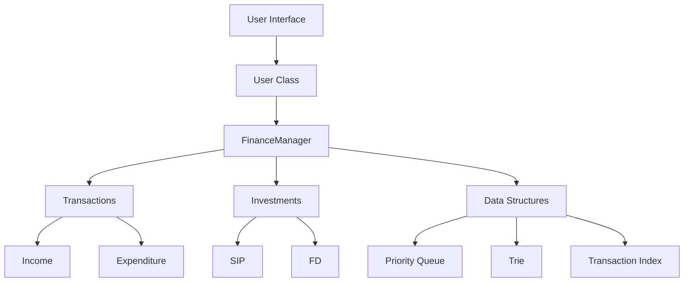
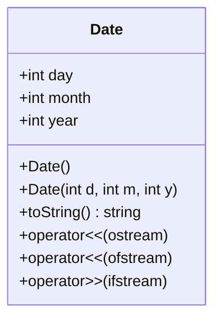
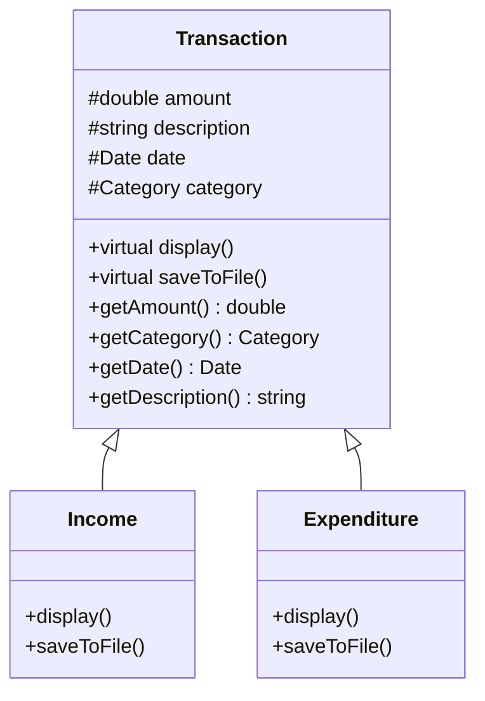
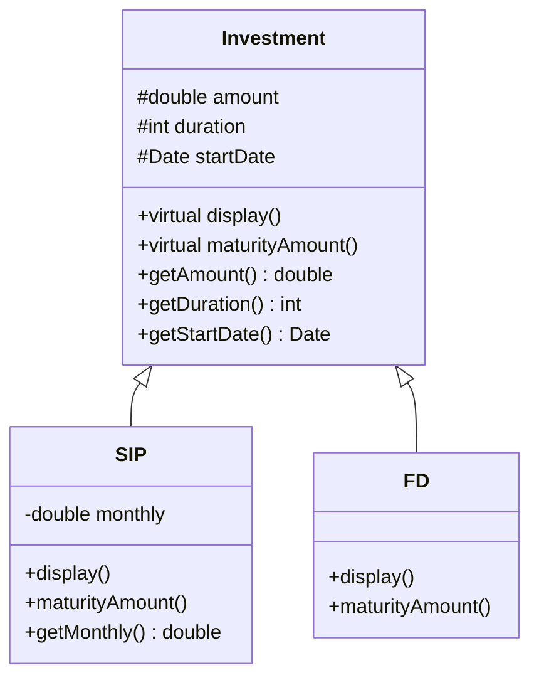
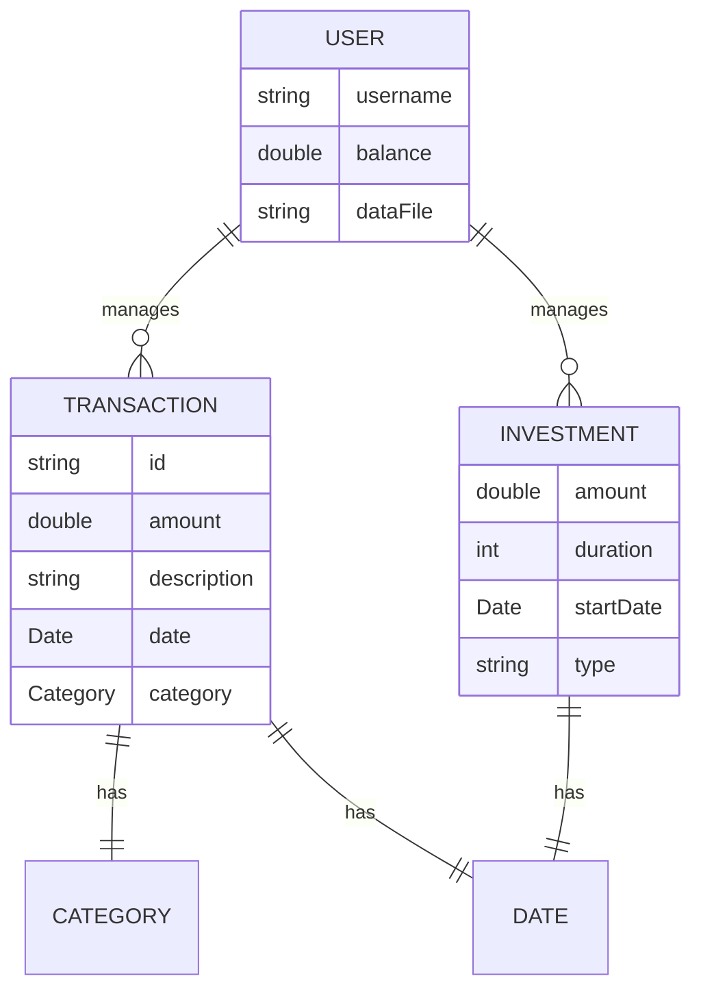
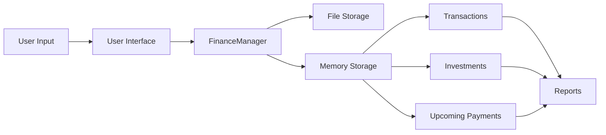

# Personal Finance Management System Documentation

## Table of Contents
1. [Overview](#overview)
2. [System Architecture](#system-architecture)
3. [Class Descriptions](#class-descriptions)
4. [Data Structures](#data-structures)
5. [Features](#features)
6. [Diagrams](#diagrams)
7. [Usage Examples](#usage-examples)
8. [Implementation Details](#implementation-details)
9. [Future Enhancements](#future-enhancements)

## Overview
The Personal Finance Management System is a comprehensive C++ application designed to help users manage their personal finances. It provides functionality for:
- Tracking income and expenses
- Managing investments (SIP and FD)
- Categorizing transactions
- Scheduling upcoming payments
- Generating financial reports
- Auto-completing transaction descriptions
- Fast transaction lookups

## System Architecture



## Class Descriptions

### Date Class


### Transaction Hierarchy


### Investment Hierarchy


## Data Structures

### 1. Priority Queue for Upcoming Payments
- **Purpose**: Manages scheduled payments and investments
- **Implementation**:
```cpp
struct UpcomingPayment {
    Date dueDate;
    std::string description;
    double amount;
    bool isInvestment;
};

struct PaymentCompare {
    bool operator()(const UpcomingPayment& a, const UpcomingPayment& b) const;
};

std::priority_queue<UpcomingPayment, std::vector<UpcomingPayment>, PaymentCompare>
```

### 2. Trie for Autocomplete
- **Purpose**: Efficient prefix-based search for transaction descriptions
- **Implementation**:
```cpp
class TrieNode {
    std::unordered_map<char, std::unique_ptr<TrieNode>> children;
    bool isEndOfWord;
};

class Trie {
    std::unique_ptr<TrieNode> root;
    void getSuggestionsRecursive();
    void insert(const std::string&);
    std::vector<std::string> getSuggestions(const std::string&);
};
```

### 3. Transaction Index
- **Purpose**: O(1) transaction lookup by ID
- **Implementation**:
```cpp
class TransactionIndex {
    std::unordered_map<std::string, Transaction*> transactionMap;
    int nextId;
};
```

## Features

### 1. Transaction Management
- Record income and expenditures
- Categorize transactions into predefined categories
- Track transaction history
- Generate monthly reports

### 2. Investment Management
- **SIP (Systematic Investment Plan)**
  - Initial investment amount
  - Monthly investment tracking
  - Duration in years
  - Compound interest calculation (9.6% p.a.)

- **Fixed Deposit (FD)**
  - One-time investment
  - Duration in years
  - Simple interest calculation (7.1% p.a.)

### 3. Smart Features
- **Autocomplete**: Quick transaction description entry
- **Upcoming Payments**: Schedule and track future payments
- **Transaction Search**: Fast lookup by ID
- **Category Analysis**: Monthly expense breakdown by category

## Diagrams

### Entity Relationship Diagram


### Data Flow Diagram


## Usage Examples

### Recording a Transaction
```cpp
// Record income
manager.addTransaction(new Income(5000.0, "Salary", Category::INCOME));

// Record expense
manager.addTransaction(new Expenditure(1000.0, "Groceries", Category::FOOD));
```

### Managing Investments
```cpp
// Create SIP
manager.addInvestment(new SIP(10000.0, 5, 2000.0)); // Initial, Years, Monthly

// Create FD
manager.addInvestment(new FD(50000.0, 3)); // Amount, Years
```

### Generating Reports
```cpp
// Monthly report
manager.generateMonthlyReport(3, 2024);

// View upcoming payments
manager.displayUpcomingPayments();
```

## Implementation Details

### File Structure
- **main.cpp**: Core application logic
- **date.h**: Date handling
- **data_structures.h**: Custom data structures

### Data Persistence
- File format: username_finance_data.txt
- Transaction format: Type Amount Description Date Category
- Investment format: Type Amount Duration Date [Monthly]

### Memory Management
- Smart pointers for automatic cleanup
- Virtual destructors in base classes
- RAII principles

## Future Enhancements
1. **Technical Improvements**
   - Database integration
   - GUI implementation
   - Data encryption
   - Cloud synchronization

2. **Feature Additions**
   - Multi-currency support
   - Investment portfolio analysis
   - Budget planning
   - Tax calculation
   - Mobile app integration

3. **Analytics**
   - Spending pattern analysis
   - Investment performance tracking
   - Predictive budgeting
   - Visual reports and graphs 

## Sample Use Case Shell Session

```shell
---Welcome to Finance Management System!!---

Enter your username: john_doe

No existing data found. Starting with a fresh account.

--OPTIONS--
1. Record INCOME
2. Record EXPENDITURE
3. Make Investment
4. Finance Information
5. Investment Information
6. Monthly Report
7. Save Data
8. Add upcoming payment
0. Exit
Enter choice: 1

Enter amount: 5000
Enter description: March Salary

Income of 5000.00 recorded successfully!

--OPTIONS--
// ... menu shown again ...
Enter choice: 2

Enter amount: 1200
Enter description: Grocery Shopping

Select category:
1. Food
2. Housing
3. Transportation
4. Entertainment
5. Utilities
6. Healthcare
7. Education
8. Other
Enter choice (1-8): 1

Expenditure of 1200.00 recorded successfully!

--OPTIONS--
// ... menu shown again ...
Enter choice: 3

Which one:
1. SIP
2. FD
0. Go back
Enter your choice: 1

Enter amount: 10000
Enter duration in yrs: 5
Enter monthly investment amount: 2000

SIP investment of 10000.00 recorded successfully!

--OPTIONS--
// ... menu shown again ...
Enter choice: 4

-----------------------------------
|        Personal Finance        |
-----------------------------------

||--BALANCE--: 3800.00||

--SAVINGS--:
Type           Date          Amount      Category        Description
-----------------------------------------------------------------------------
Income         15/3/2024     5000.00     Income         March Salary
Expenditure    15/3/2024     1200.00     Food           Grocery Shopping

--INVESTMENTS--
Type           Amount      Duration    Start Date    Monthly amount
--------------------------------------------------------------------------------
SIP            10000.00    5          15/3/2024     2000.00

--OPTIONS--
// ... menu shown again ...
Enter choice: 8

1. Add upcoming payment
2. View upcoming payments
3. Search transactions
Enter choice: 1

Enter amount: 2500
Enter description: Rent Payment
Enter due date (day month year): 1 4 2024

Upcoming payment added successfully!

--OPTIONS--
// ... menu shown again ...
Enter choice: 8

1. Add upcoming payment
2. View upcoming payments
3. Search transactions
Enter choice: 2

--UPCOMING PAYMENTS--
Date           Description          Amount      Type
--------------------------------------------------------------
1/4/2024      Rent Payment         2500.00     Payment

--OPTIONS--
// ... menu shown again ...
Enter choice: 6

Enter month (1-12): 3
Enter year: 2024

----- Monthly Report for 3/2024 -----
Total Income: 5000.00
Total Expenses: 1200.00
Net Savings: 3800.00

Expense Breakdown by Category:
                Food: 1200.00 (100.0%)

--OPTIONS--
// ... menu shown again ...
Enter choice: 0

Thank you for using the Finance Management System!
```

This shell session demonstrates:
1. Creating a new user account
2. Recording income and expenses
3. Making an investment (SIP)
4. Viewing financial information
5. Setting up and viewing upcoming payments
6. Generating a monthly report
7. Proper handling of categories and dates
8. Real-time balance tracking

The system maintains data integrity throughout the session and provides clear feedback for all operations. 
